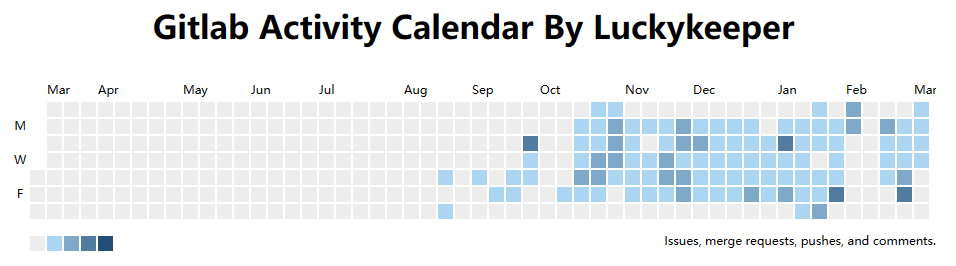

# gitlabCalendar

## 简介

ASP.NET Core Web API 练手项目：GitLab私仓提交日历抓取和可视化，向大家展示你在公司的~~摸鱼~~工作情况吧ヾ(≧▽≦*)o

demo: [https://gitlab-calendar.luckykeeper.site:44443/](https://gitlab-calendar.luckykeeper.site:44443/)

鼠标放上去可以看到当天的 Contribution，数据在程序启动后每 30 分钟抓取一次



C# 练手 mini project ，涉及到的内容：ASP.NET Core Web API + Serilog 日志 + Coravel 定时任务 + SqlSugar ORM + SqLite + 依赖注入 + HtmlAgilityPack 爬虫

## 使用

下载 Release 包，解压，在同级目录新建一个 `Config.ini` 文件，其模板如下

```ini
# [GitLabCalendar] 固定
[GitLabCalendar]
# GitLab 私仓的地址，记得结尾加 /
EndPoint=http://code.example.com:12306/
# GitLab 的用户名
User=zhangsan
# GitLab 的密码
Password=superPassw@rd
```

依赖环境为：dotnet8 SDK

RHEL 安装环境参考和示例：[在 RHEL 和 CentOS Stream 上安装 .NET - .NET | Microsoft Learn](https://learn.microsoft.com/zh-cn/dotnet/core/install/linux-rhel#dependencies)

```bash
rpm -Uvh https://packages.microsoft.com/config/centos/8/packages-microsoft-prod.rpm
yum install dotnet-sdk-8.0
```

运行命令为：

```bash
# --urls 指定了监听端口，不加的话只能本地访问
dotnet gitlabCalendar.dll --urls "http://0.0.0.0:5000"
```

## Special  Thanks  To

[scriptex/gitlab-calendar: Embed your Gitlab calendar everywhere. (github.com)](https://github.com/scriptex/gitlab-calendar) 前端文件基于此微有改动
